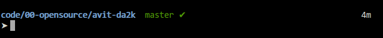
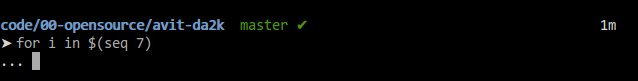

# avit-da2k

> oh-my-zsh theme based on avit theme

## Installation

```console
bash -c "$(curl https://raw.githubusercontent.com/fdaciuk/avit-da2k/master/install.sh)"
```

## Differences from avit

**Right arrow:**



**Dots instead left arrow:**



## License

[MIT](https://github.com/fdaciuk/licenses/blob/master/MIT-LICENSE.md) &copy; Fernando Daciuk
